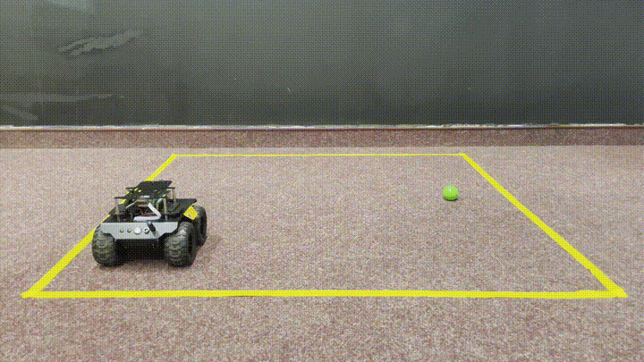
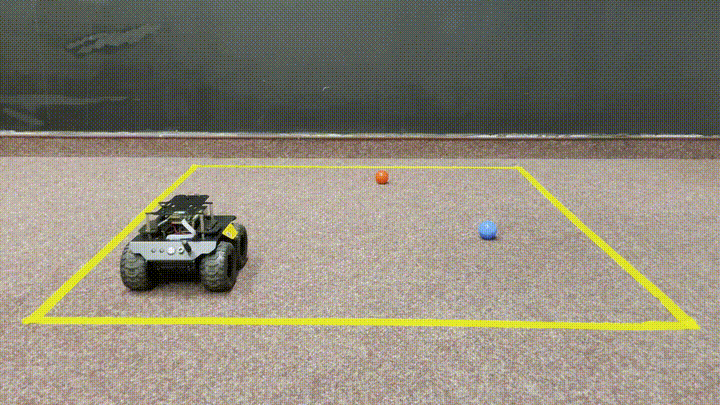

# RaspRover – Computer Vision & Machine Learning Challenge Project

## Disclaimer
This project was developed with only four weeks of access to the rover hardware.  
As a result, the code is primarily functional and educational rather than fully optimized or architecturally polished.

## Project Overview
This project extends the RaspRover base image **UGV_S10_240518** from [Waveshare](https://www.waveshare.com/rasprover.htm) 
Three challenge stages gradually increase the rover’s autonomy, perception capabilities, and decision logic.

> **Note:** Clicking on the demo videos will open them on YouTube.

---

## Challenges

### Challenge 1
- Three colored balls 🟢 🔴 🔵 are placed within a 1×1 meter area around the rover.  
- The rover starts when the *mano cornuta* gesture 🤘 (“rock on” sign) is detected.  
- The rover searches for and identifies the green ball 🟢.  
- The rover approaches the green ball 🟢 and stops approximately 20 cm in front of it.

**External View**

  

**Onboard View**

  

---

### Challenge 2
- Three colored balls 🟢 🔴 🔵 are placed within a 1×1 meter area around the rover.  
- The rover starts once a finger count from 1 to 3 is correctly detected.  
- The rover searches for and identifies the red ball 🔴.  
- The rover approaches the red ball 🔴 and stops approximately 20 cm in front of it.  
- The rover autonomously searches for and identifies the blue ball 🔵.  
- The rover approaches the blue ball 🔵 and stops approximately 20 cm in front of it.

**External View**

  

**Onboard View**

  

---

### Challenge 3
- Three colored balls 🟢 🔴 🔵 are placed within a 1×1 meter area around the rover.  
- A three-digit number is determined using a controller 🎮.  
- The number is handwritten on a white sheet of paper.  
- The rover starts only after correctly recognizing the handwritten three-digit number.  
  Invalid numbers must be rejected reliably.  
- The rover autonomously searches for and identifies the red ball 🔴.  
- The rover approaches the red ball 🔴 and stops approximately 20 cm in front of it.  
- The rover then autonomously searches for and identifies the green ball 🟢.  
- The rover approaches the green ball 🟢 and stops approximately 20 cm in front of it.  
- Finally, the rover searches for and identifies the blue ball 🔵.  
- The rover approaches the blue ball 🔵 and stops approximately 20 cm in front of it.

**External View**

  

**Onboard View**

  

---

## Used Libraries

### Computer Vision / Image Processing
- `picamera2` – Raspberry Pi camera access  
- `cv2` (OpenCV) – image processing  
- `imutils` – image convenience utilities  
- `mediapipe` – ML pipelines such as hand-tracking

### Machine Learning / Neural Networks
- `torch`  
- `torch.nn`

### Multimedia / UI
- `pyttsx3` – offline text-to-speech

### Hardware Input
- `pygame` – controller / joystick input

---